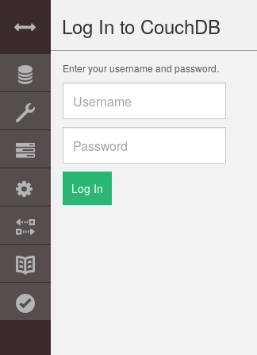
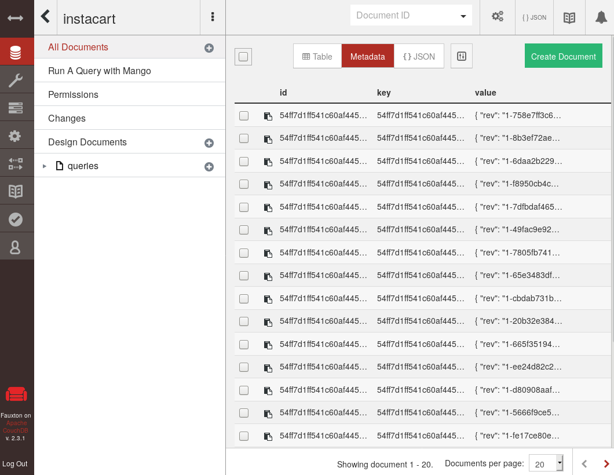
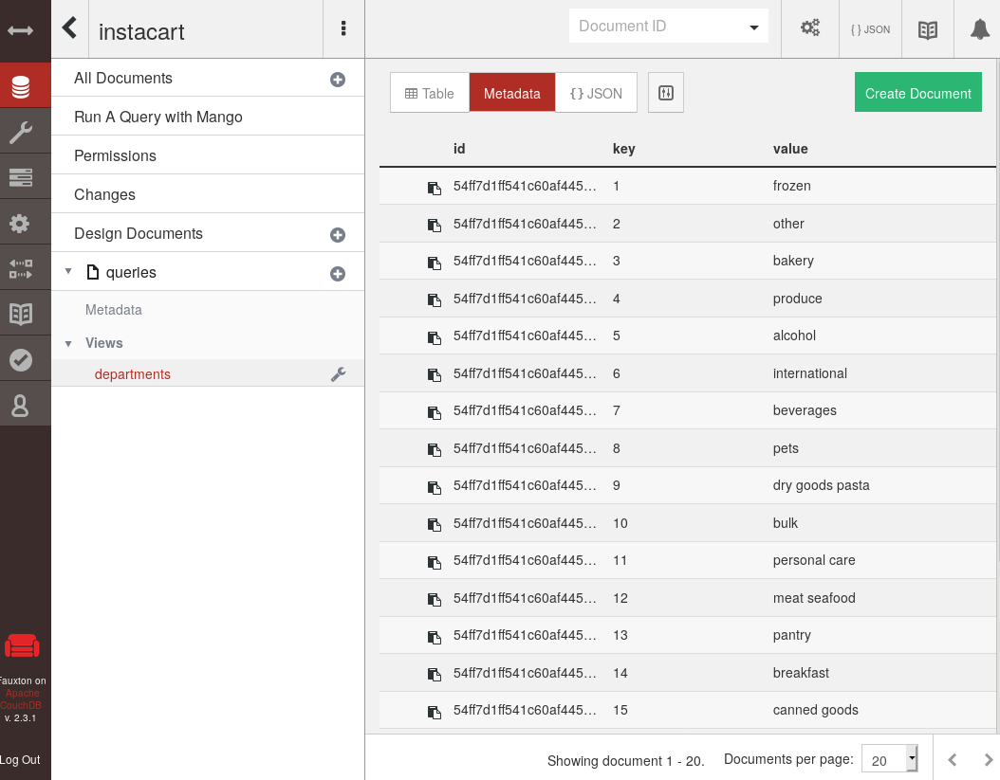
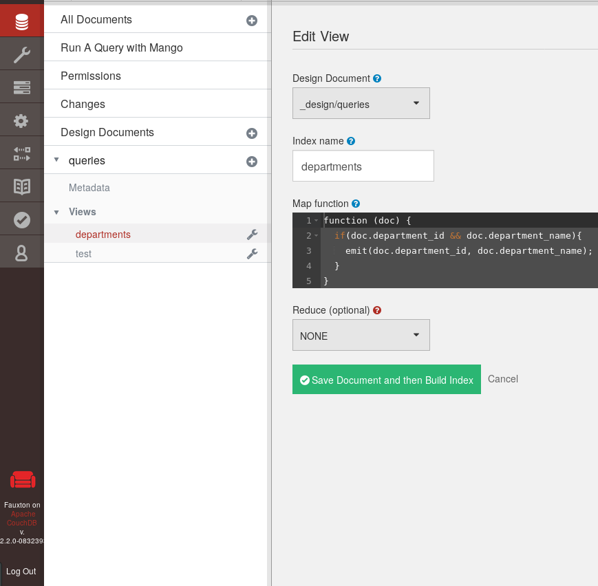

# :books: NoSQL databases
LINGI2145 Autumn, 2019 -- Etienne Rivière, Paolo Laffranchini and Raziel Carvajal-Gómez

:warning: If you **have not completed** the authentication service tutorial ([link here](./02_ProjectSetup_AuthenticationService.md#books-lingi2145-project-authentication-microservice)), do it before going through this tutorial .

# Introduction
This tutorial provides you with the basics of using [CouchDB](http://docs.couchdb.org/en/stable/index.html), a popular NoSQL database.
The authentication service you have learned to design in the previous tutorial keeps users information in memory.
We will learn how to link the service implementation to a Docker container running the CouchDB database to store authentication information persistently.

# Objectives
Concretely, this tutorial shows you how to:

1. Set up a container supporting CouchDB;
1. Use the REST API of CouchDB;
1. Navigate through the data stored in a CouchDB instance with Fauxton - the GUI of CouchDB;
1. Store the authentication information of users in a CouchDB database;
1. Crate views to query objects in CouchDB.

:bulb: **Recall.**
We encourage you to follow the tutorial solo.

:bulb: **Recall.**
This tutorial requires you to complete some exercises that are tagged with this icon :pencil2:

# CouchDB in a Nutshell

CouchDB is a NoSQL database system where data is kept in the form of JSON documents.
CouchDB provides an HTTP REST API to interact with this data and manage databases.

We provide you with a Dockerfile to create a pre-configured image of CouchDB.
The `storage` directory (located at `../src/back-end`) contains this Dockerfile.
You will need to complete the following tasks to build an image and instantiate a container:

:pencil2: **Exercises.**
1. Build an image of the provided Dockerfile and name it `kv-storage-system`;
1. Run a container of this image using the port mapping rule `-p 3000:5984` and named `users-db`.
    - `3000` is an available port in the host running Docker;
    - `5984` is the port number CouchDB uses by default.
    - :warning: **Keep `users-db` running.** You will make use of this container in the following sections.

Use `curl` to send HTTP requests from the terminal and test the service -replace `HOST_RUNNING_DOCKER` by the IP address of the VM hosting the container.

```bash
curl --request GET http://HOST_RUNNING_DOCKER:3000
```

This command returns a JSON object:

```json
{
  "couchdb": "Welcome",
  "version": "2.0.0",
  "vendor": {
    "name": "The Apache Software Foundation"
  }
}
```

You can access a GUI (Graphical User Interface) by using [Fauxton](http://docs.couchdb.org/en/stable/intro/tour.html?highlight=fauxton#welcome-to-fauxton), the built-in Web interface of CouchDB.
Access it with your web browser by typing the address *HOST_RUNNING_DOCKER:3000/_utils*.
You should see the following login page:



To log in, write `admin/admin` as `username/password`.

Below, you have a list of useful commands. Execute such commands and note the effect on the Fauxton GUI (you might to refresh the web page to after every command).

- Create a database with the name `DB_NAME`:
    - `curl --request PUT admin:admin@HOST_RUNNING_DOCKER:3000/DB_NAME`
- List available databases:
    - `curl --request GET admin:admin@HOST_RUNNING_DOCKER:3000/_all_dbs`
- Store a JSON document in a database:
    - `curl --request POST --data '{"date": "01/01/1968", "event": "watch-tv"}' -H "Content-Type: application/json" admin:admin@HOST_RUNNING_DOCKER:3000/DB_NAME`
- Delete a database with the name `DB_NAME`:
    - `curl --request DELETE admin:admin@HOST_RUNNING_DOCKER:3000/DB_NAME`

:pencil: **Note.**
This is just an introduction of CouchDB, in a following section you will learn how to query stored JSON documents. Find more details about how to handle databases in the following links:
- [Get started guide](http://docs.couchdb.org/en/stable/intro/tour.html#getting-started)
- [Design of JSON documents](http://docs.couchdb.org/en/stable/ddocs/ddocs.html#design-documents)

# Use CouchDB to store authentication information
The authentication microservice we built during the previous tutorial does not store user authentication information on persistent storage, but keeps that information in memory [see here](../src/back-end/users/src/utils/crud.js#L13-L15).

Instead, we would like to use a CouchDB database to store this data.

We will use [nano](https://github.com/apache/nano#nano), a NPM library, to access the REST API of CouchDB from the authentication microservice by implementing an additional interface (link to code [here](../src/back-end/users/src/utils/crud-wp.js)).

The database can be queried by configuring a nano instance with the URL of the CouchDB database.
We do so by reading an environment variable `DB_URL` (defined in the Dockerfile of the microservice, link to code [here](../src/back-end/users/Dockerfile#L30)) to the running container.

```javascript
var users = require('nano')(process.env.DB_URL)
```

Concretely, the complete URL needed by `nano` to access the database of users has the following structure: `${ADMIN_NAME}:${ADMIN_PASSW}@${DB_HOST}:${DB_PORT}/${DB_NAME}`, where:

- *ADMIN_NAME/ADMIN_PASSW*: username and password to perform operations (create/remove/update/delete) on objects in our DB;
- *DB_HOST*: name of a container running CouchDB;
- *DB_PORT*: port where CouchDB is listening;
- *DB_NAME*: name of the database.

:pencil2: **Exercises.**

1. Re-build the image of the authentication microservice.
1. Run an instance of the microservice.
1. Consult the logs of the container and make sure the service was properly started.
1. Test the authentication microservice API by registering a new user (see previous [tutorial](02_ProjectSetup_AuthenticationService.md#test-auths-with-curl)).
1. Use the Fauxton API to ensure the new user's details have been stored in couchDB.

:pencil2: **Note.**
You might have noticed that now the authentication microservice is launched with the script [boot-in-order.sh](../src/back-end/users/boot-in-order.sh#L22). The reason of using an script is because the new authentication service now depends on CouchDB and therefore, it needs to ensure the database has been properly created before starting servicing requests.

You now know how to store and get objects with CouchDB.
Queries for individual objects will follow this pattern.
In the following, we show how to run *queries* over collection of objects, directly over CouchDB (i.e. without retrieving a set of keys and filtering them locally).

# Querying objects in CouchDB

We will show you, using the GUI of CouchDB, how to query stored objects.
The ability to query, e.g. find a set of values according to some criteria, will prove useful for some of your microservices, where fetching and storing individual keys only may be cumbersome.

## :pencil2: Exercise: Analysis of Grocery Orders

As member of the World Health Organization (WHO), you are in charge of reporting the amount of products that US citizens buy on-line, grouped by departments.

You are provided with a sample of the Open Source dataset of [Instacart](https://tech.instacart.com/3-million-instacart-orders-open-sourced-d40d29ead6f2).
This dataset is provided in form of a CouchDB database.
Orders are kept as JSON objects with the following format.

```json
{
  "order_id": 4,
  "product_id": 46842,
  "product_name": "Plain Pre-Sliced Bagels",
  "department_name": "bakery"
}
```

To get access of such database, perform the following tasks.

:pencil2: **Exercises.**

1. Build an image, with the tag `store-instacart-dataset`, from the docker file in the `instacart` directory;
1. Run a container of `store-instacart-dataset` and link it with the container `users-db`;
    - **Recall.** The option `--link` let a running container to communicate with others (already) deployed containers.
1. Consult the logs of this running container.

The container you deploy, creates the `instacart` database and stores every object of the public Instacart dataset. You can confirm that there is a new database in the container running CouchDB, using the GUI (as shown below).



The database also contains the query **departments** to list every department in the on-line store.
You can see the output of this view by clicking on ***queries > departments*** right below the category ***Design Documents*** (see image below).



Observe that a function in JavaScript is required to select all departments.
You can see the implementation of this query by clicking on the wrench icon (:wrench:) next to  ***departments*** and then select the edit option (see image below).



The function is executed over all documents stored in the database (*line 1*).
One document refers to a department **if an only if** the fields `department_id` & `department_name` are present (*line 2*).
Finally, the emit function (*line 3*) add an entry of interest to the result set with the department identifier as key and the name of the department as value (remember, documents in CouchDB are key-value objects).

To accomplish your mission as member of WHO, we will simply query the database for the number of purchased products, grouped by department, over the whole dataset.

Given that we need to count the number of products per department, our JavaScript function will simply report `1` when a product from a certain department is found. Here you have the implementation of such query:

```javascript
function (doc) {
  // we assure that [doc] refers to one purchase
  if ( doc.order_id && doc.department_name ) {
    // we report once the department of a product
    emit(doc.department_name, 1);
  }
}
```

Now we just have to sum the number of occurrences per department.
To do so, we will use the built-in `SUM` function of CouchDB. Follow the next steps to implement our view:

1. Click on the icon of plus (**+**) next to **queries**, right below **Design Documents** and select **New View**
1. In the field **Index name** write the name of our view: **items_per_dept**
1. Replace the code within the field **Map function** with the snippet shown before
1. Chose **_sum** as reduce function
1. Save the view by clicking on **Create Document and then Build Index**

That's it, you already known how many products were bought per department.
Corroborate the output of the query writing down in a terminal (on your laptop) the next command:

`curl --request GET admin:admin@${HOST_RUNNING_DOCKER}:3000/instacart/_design/queries/_view/items_per_dept?group=true`

you will get an output similar to this one:

```javascript
{"rows":[
{"key":"alcohol","value":2},
{"key":"babies","value":13},
{"key":"bakery","value":31},
{"key":"beverages","value":77},
{"key":"breakfast","value":16},
{"key":"bulk","value":2},
{"key":"canned goods","value":36},
{"key":"dairy eggs","value":163},
{"key":"deli","value":39},
{"key":"dry goods pasta","value":28},
{"key":"frozen","value":73},
{"key":"household","value":37},
{"key":"international","value":10},
{"key":"meat seafood","value":25},
{"key":"missing","value":1},
{"key":"other","value":2},
{"key":"pantry","value":54},
{"key":"personal care","value":25},
{"key":"pets","value":5},
{"key":"produce","value":282},
{"key":"snacks","value":78}
]}
```

# Final comments
:checkered_flag: **That's it, you made it.**
You have now the basics of how to use CouchDB and query stored objects in CouchDB databases.
