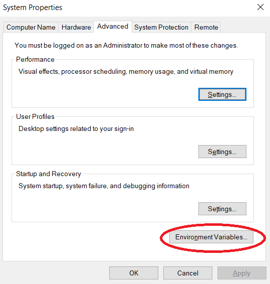
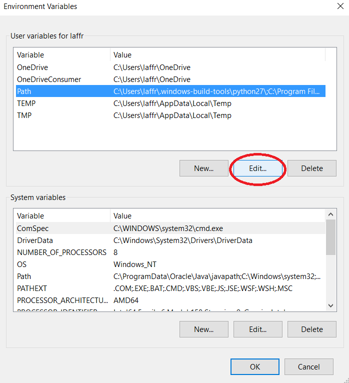
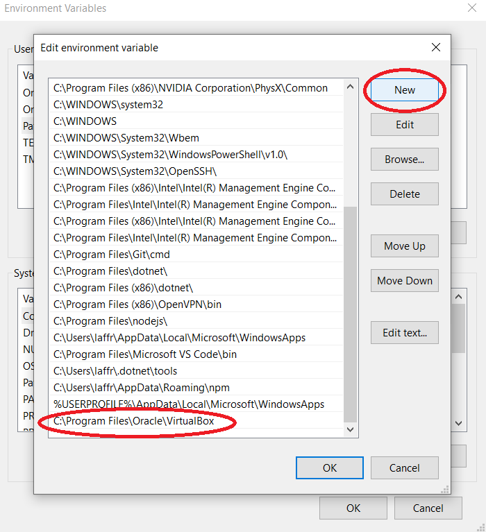

# :books: Required software for the Cloud Computing course
**LINGI2145 Autumn, 2019** -- *Etienne Rivière, Paolo Laffranchini and Raziel Carvajal-Gómez*

# Overview

We will use the [VirtualBox](https://www.virtualbox.org/) hypervisor.

Follow the instructions below to install VirtualBox on your computer, depending on the Operating System you are currently running.

Consult the official VirtualBox documentation ([here](https://www.virtualbox.org/manual/ch02.html)) in case you need additional details or troubleshooting information.

## Linux / MacOS

- [GNU/Linux based host](https://www.virtualbox.org/wiki/Linux_Downloads) (such as Debian, Ubuntu, Fedora, others);
- [OS X host](https://www.virtualbox.org/wiki/Downloads).

## Windows 10

Visit the download section of the official VirtualBox website [here](https://www.virtualbox.org/wiki/Downloads) and download the latest installation package.

<!-- :warning: If you need 32-bit OS support make sure you install the latest 5.2.X version (5.2.32), whose download is available [here](https://www.virtualbox.org/wiki/Download_Old_Builds_5_2). It will be supported until July 2020, but we hope you will have passed the exam by that date. :stuck_out_tongue: -->

When the download is completed, launch the installation executable and follow the instructions on screen.
Default installation configuration should be sufficient.

Once completed, remember to add the installation directory to your `PATH` environment variable.
This is needed to allow your OS to find the VirtualBox executables when you launch them from the terminal.
Proceed like this (screenshots below):

1. Press the Windows key and type *environment*. An option "Edit the system environment variables" should be displayed; click *Enter*; a pop-up window will be shown.
2. Click on the *Environment Variables...* button; a new pop-up window will be shown.
3. Select the *Path* environment variable from the user variables section, then click *Edit*.
4. In the (last) pop-up window, click on *New* and then add the full path to the VirtualBox installation directory (e.g.: C:\Program Files\Oracle\VirtualBox).
5. Click *OK* on all (3) pop-up windows.

#### Additional tools

Under Windows, you will need additional tools: an SSH client and an SCP client.

##### PuTTY

[PuTTY](https://putty.org/) is a free and open-source terminal emulator, serial console and network file transfer application. You will use it to connect to your virtual machines using SSH.

[MTPuTTY](http://ttyplus.com/multi-tabbed-putty/) is a client which allows to manage multiple PuTTY session tabs.

##### WinSCP

[WinSCP](https://winscp.net/eng/index.php) (Windows Secure Copy) is a free and open-source SFTP, FTP and SCP client for Microsoft Windows. Its main function is secure file transfer between a local and a remote computer. Beyond this, WinSCP offers basic file manager and file synchronization functionality.

WinSCP will prove handy to transfer files onto your VMs, thus allowing you to develop the course project on your local computer using your favorite editor. :wink:
