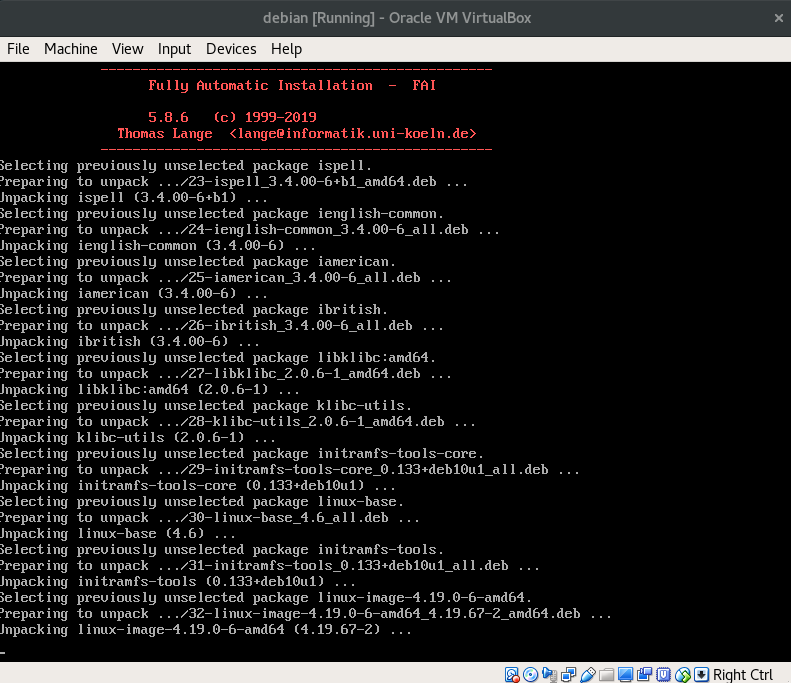
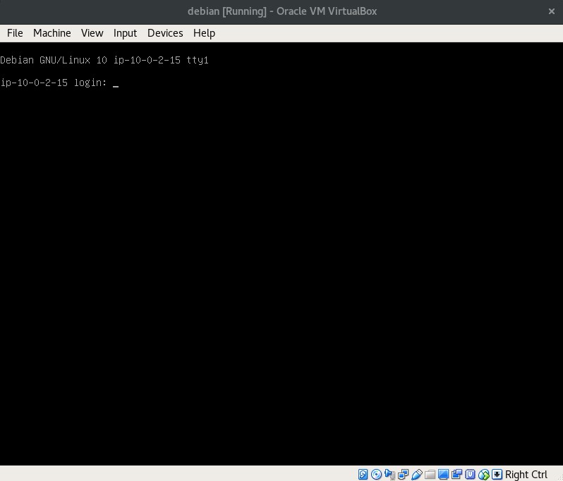

# :books: Lab Session 1: Virtual Machines
LINGI2145 Autumn, 2019 -- Etienne Rivière, Paolo Laffranchini and Raziel Carvajal-Gómez

# Objectives

The goal of this tutorial is to show you how to set up a virtualized infrastructure similar to a remote cloud IaaS, on your own laptop.
This virtualized infrastructure will feature several virtual machines (VMs) linked by a virtual network.
The virtual machine image you will build during this session will be reused for all tutorials and for the project.
As an additional exercise, you will deploy a Web hosting service as an example of an application running over multiple VMs.

At the end of this tutorial, you will know how to:

- create and deploy Virtual Machines (VMs);
- create a network to let VMs communicate with each other;
- install and deploy an multi-tier web application using several VMs.

:warning:
**Prerequisites.** Before you continue, click on [THIS LINK](Prerequisites.md) to install the required software.

:warning:
We encourage you to **follow the tutorial solo**.

:warning:
This tutorial requires you to complete some exercises, which are tagged with this icon: :pencil2:

# Setup a virtual infrastructure with VirtualBox

In this section you will learn how to configure and create a new Virtual Machine (VM), how to clone it, and how to deploy multiple VMs on the same host (your laptop). VMs host a minimalistic GNU/Linux Operating System (OS) with only the necessary software packages.

:bulb:
We also want to limit the amount of resources used by each VM (hard drive space, CPU, memory).

VirtualBox comes with a Command Line Interface (CLI) accessible from a terminal on your laptop using the command `VBoxManage`. Learning the CLI of VirtualBox right from the start is important to enable automatization later. Feel free to find further details on the official [documentation](https://www.virtualbox.org/manual/ch08.html).

:warning:
From now on, you will be asked to write down different commands in a terminal of your laptop. For this tutorial the working directory is the folder `tutorials/01_VirtualMachines`, open a terminal and be sure to be in this directory.

### Create and set up a virtual machine

We start by creating a new (empty) VM and registering it with the name `myvm`.

`VBoxManage createvm --name myvm --ostype "Debian_64" --register`

We also require to create a hard disk drive, with capacity of ~4GB, to install a GNU/Linux distribution, as well as its controllers.
These three commands do, respectively: Create a virtual hard drive, create a virtual disk controller for the VM, and finally attach the virtual hard drive to the virtual controller.

```
VBoxManage createhd --filename myhdd.vdi --size 4000
VBoxManage storagectl myvm --name "SATA Controller" --add sata --controller IntelAHCI
VBoxManage storageattach myvm --storagectl "SATA Controller" --port 0 --device 0 --type hdd --medium myhdd.vdi
```

We will install a fresh operating system in our VM from an ISO image (a virtual DVD-ROM).
We therefore need a virtual CD/DVD drive attached to our VM:

`VBoxManage storagectl myvm --name "IDE Controller" --add ide`

We will load a virtual DVD into this virtual DVD drive.
Click on [THIS LINK](https://drive.google.com/uc?id=14unF7eDB5-yVNAbArymnUdTA9alXiW0c&export=download
) to download the ISO image and save it in the local folder `01_VirtualMachines`.
Let us now load this virtual DVD into the virtual DVD drive:

`VBoxManage storageattach myvm --storagectl "IDE Controller" --port 0 --device 0 --type dvddrive --medium mini.iso`

As for a physical machine, our virtual machine has a boot order: It will look onto its storage devices in a certain order and boot the first one that contains an operating system (OS).
There is currently no OS on our virtual disk, but the virtual DVD (Debian installer) is bootable.
We can therefore use the order disk first, then DVD:

`VBoxManage modifyvm myvm --boot1 disk --boot2 dvd`

Finally, we set the amount of RAM for our VM to 1GB.

`VBoxManage modifyvm myvm --memory 1024`

Our VM is now ready to run. You can start it using the command: `VBoxManage startvm myvm`.

### GNU/Linux installation

VirtualBox pops up a virtual screen (see image below).
The VM boots on the virtual DVD and starts the Debian GNU/Linux installer.



The installation is **fully automated**.
When it finishes, press *Enter* and the machine reboots.

Now that the virtual hard drive contains a bootable sector, the virtual machine starts the freshly installed Debian OS. You are asked to login into your new OS, you may do so with the username: `user` and password: `user`.

<!--  -->

By default, VirtualBox associates your VM with a virtual Network Interface Controller (NIC) providing Internet access through NAT ([Network Address Translation](https://en.wikipedia.org/wiki/Network_address_translation)).
You can confirm the internet is reachable using the command `ping google.com` and also, by installing new software.

#### Extend your guest OS with new packages
In the following sections we will use `wget`, a software package to retrieve content via a bunch of Internet protocols (e.g. HTTP or FTPS). Install `wget` as follows (type `user` as password when needed): Update the list of Debian repositories with `sudo apt-get update` and then, install `wget` with `sudo apt-get install -y wget`.

:pencil2: **Exercise.**
We will also need the suite of network utilities of Debian `net-tools`: install the corresponding package.

To conclude this section, from the console of your VM power-off the VM with `sudo systemctl poweroff` (note that there is a small delay between the command and the actual shutdown).

#### VirtualBox virtual screen
VirtualBox pops up a virtual screen when we start our VM.
This is convenient for a guest OS with a graphical interface, e.g. for running Windows in a VM on a Mac.
However, this is not how VMs are accessed in the cloud: Only remote access is available using a secure remote connection with SSH.
We will set up this access method later, but first we need to create a proper virtual network.

### Network configuration
Our goal is to have a local infrastructure with multiple VMs.
The network support of virtual box only allows connections from the guest VM to the Internet, as is arguably sufficient for most users.
In our case, we need to setup a virtual network that will allow several guest VMs to communicate between them in addition to communicating to remote services.
This virtual network will feature a DHCP server to dynamically assign IP addresses to VM guests OS.

In the following two sections, we will:
1. Enable a Host-Only network interface on your host OS and set it up in your VM;
2. Configure the VM to automatically request an IP address for that interface using DHCP.

#### Setup a virtual Host-Only network with a DHCP server

VirtualBox provides ready-made network interfaces.
You can list the details of pre-configured host-only interfaces using `VBoxManage list hostonlyifs`.

:warning:
If the list of interfaces is empty, create one with the command `VBoxManage hostonlyif create` and check the list again.

You should obtain an output similar to this one:

```
Name:            vboxnet0
GUID:            786f6276-656e-4074-8000-0a0027000000
DHCP:            Disabled
IPAddress:       192.168.33.1
NetworkMask:     255.255.255.0
IPV6Address:     
IPV6NetworkMaskPrefixLength: 0
HardwareAddress: 0a:00:27:00:00:00
MediumType:      Ethernet
Status:          Down
VBoxNetworkName: HostInterfaceNetworking-vboxnet0
```

We will use the above network interface *vboxnetX* (*VirtualBox Host-Only Ethernet Adapter #X*) as our virtual network.

:warning:
On Windows, interface names are a bit more articulated (e.g.: *VirtualBox Host-Only Ethernet Adapter #123*).
In the commands below, make sure to surround the interface name with double-quote to deal with spaces.

The assignment of IP addresses to the OS guest VM should rely on a DHCP server.
The following command will create such a server, attached to *HOSTONLY_IF_NAME* (`vboxnet0` in the above example).
We also configure the DHCP server with a pool of 100 IP addresses:

`VBoxManage dhcpserver add --ifname HOSTONLY_IF_NAME --ip HOSTONLY_IF_SUBNET.1 --netmask 255.255.255.0 --lowerip HOSTONLY_IF_SUBNET.100 --upperip HOSTONLY_IF_SUBNET.199`

:warning:
Replace HOSTONLY_IF_NAME with the name of the Host-Only interface and HOSTONLY_IF_SUBNET with its correct subnet (e.g. `192.168.33.` in the example).

You can now enable the DHCP service with:

`VBoxManage dhcpserver modify --ifname HOSTONLY_IF_NAME --enable`

Finally, we also add a *second* network card to our VM and virtually link it to *HOSTONLY_IF_NAME*.

`VBoxManage modifyvm myvm --nic2 hostonly --hostonlyadapter2 HOSTONLY_IF_NAME`

That's it! You configured your first virtual network and your laptop is also part of it.
You can confirm this by listing the network interfaces in your host OS.
On a Linux host you can use the command `ip address` (`ipconfig` under Windows, `ifconfig` on a Mac/BSD) and observe that your host has an IP address assigned to *HOSTONLY_IF_NAME*. Below is a sample of such output:

Under Linux:
```
vboxnet0: <NO-CARRIER,BROADCAST,MULTICAST,UP> mtu 1500 qdisc pfifo_fast state DOWN group default qlen 1000
    link/ether 0a:00:27:00:00:00 brd ff:ff:ff:ff:ff:ff
    inet 192.168.33.1/24 brd 192.168.33.255 scope global vboxnet0
       valid_lft forever preferred_lft forever
```

Under Windows:
```
Ethernet adapter VirtualBox Host-Only Network #9:

   Connection-specific DNS Suffix  . :
   Link-local IPv6 Address . . . . . : fe80::49b3:5:11c7:487e%27
   IPv4 Address. . . . . . . . . . . : 192.168.33.1
   Subnet Mask . . . . . . . . . . . : 255.255.255.0
   Default Gateway . . . . . . . . . :
```

#### Update the network configuration of a VM's OS

Now that we have created a Host-Only network interface and set-up a DHCP server for it, we need to update our VM's OS network configuration accordingly:

1. Start again the VM from host: `VBoxManage startvm myvm`;
2. Login using the user/user login name and password;
3. List network interfaces with the command `ip address`. You get an output similar to this one:

  ```
  user@unassigned-hostname:~$ ip address
  2: enp0s3: <BROADCAST,MULTICAST,UP,LOWER_UP> mtu 1500 qdisc pfifo_fast state UP group default qlen 1000
      link/ether 08:00:27:3d:a9:c2 brd ff:ff:ff:ff:ff:ff
      inet 10.0.2.15/24 brd 10.0.2.255 scope global dynamic enp0s3
         valid_lft 86316sec preferred_lft 86316sec
      inet6 fe80::a00:27ff:fe3d:a9c2/64 scope link
         valid_lft forever preferred_lft forever
  3: enp0s8: <BROADCAST,MULTICAST,UP,LOWER_UP> mtu 1500 qdisc pfifo_fast state DOWN group default qlen 1000
  ```

4. Note down the name of the new network interface ( `enp0s8` in this case) -- You can see there is no IP address assigned to this interface.

5. Using a text editor as the root user (using `sudo nano`), replace the content of file `/etc/network/interfaces` by the one shown below. This instructs the OS to fetch an IP for our new virtual interface using DHCP.

  ```
  # loopback interface
  auto lo
  iface lo inet loopback

  # interface for NAT
  allow-hotplug enp0s3
  iface enp0s3 inet dhcp

  # interface for our virtual network using DCHP
  allow-hotplug enp0s8
  iface enp0s8 inet dhcp
  ```

  :bulb:
  **Recall.** In `nano` you press *Ctrl+O* to save the changes, confirm them and leave the editor with *Ctrl+X*.

6. Restart the network interface with `sudo /sbin/ifup enp0s8`

7. List again the network interfaces via `ip address`. Verify that your VM has a new IP address assigned to the enp0s8 interface (and write it down!).

You can also change the identifier of your guest OS, the *hostname*. To do so, follow these steps (in this example, we use `my-debian` as hostname):

1. Set a new hostname with `sudo hostnamectl set-hostname my-debian`;
1. Update the file `/etc/hosts` as root with the editor `nano` to replace the previous hostname. This is an example of how the file `/etc/hosts` may look like:
    ```
    127.0.0.1   my-debian
    ::1         my-debian ip6-localhost ip6-loopback
    ff02::1 ip6-allnodes
    ff02::2 ip6-allrouters
    ```
    :bulb:
    You just have to replace the word `localhost` with `my-debian` in only two places (as shown in the previous output).
1. Press *C+d* to log out and login again using the user/user login name and password. Notice that your new hostname is `my-debian`.

#### Connecting to your VMs using SSH

Our final step in setting up the VM is to allow remote and secure connection using SSH.
We will first connect using a password-based authentication, and then set up the automatic login using a RSA keypair.

From a terminal **on your host system** (laptop), run `ssh user@VM_IP_ADDRESS`.

As before, the login credentials are: `username=user` and `password=user`.
Keep this connection open as we will need it soon.

:warning:
Remember that, under Windows, you have use the PuTTY client to login with SSH into your VMs.

##### Automatic login with a RSA keypair

We will set up a [RSA key pair](https://en.wikipedia.org/wiki/Public-key_cryptography) on the host OS and use it for automated authentication in the guest VM OS.

Follow the instructions [HERE](RSAKeyPair.md) to configure your host and guest VM with RSA authentication.

### VirtualBox additional packages for guest OSs
As you have seen in this tutorial VBoxManage creates and configures virtual resources (e. g. network interfaces, drivers, etc). It can also let you run programs at guest OSs. This can be useful, for instance, to get the IP address of the guest OS or list the content of the home directory.

To control guest OSs from your laptop through VBoxManage, we need to install the package Guest Additions (more details on [this link](https://www.virtualbox.org/manual/ch04.html)) of VirtualBox following these steps:

1. In a terminal with an open session to the guest OS, install the required packages.

    `sudo apt-get install -y build-essential module-assistant`
1. Configure your system to build a kernel-based module for `VBoxManage`.

    `sudo m-a prepare`

    :warning: In this step, confirm the changes typing *Y* and complete with *Enter*.
1. We are now ready to install Guest Additions. Fetch the ISO image of guest additions with `wget`.

    `wget https://download.virtualbox.org/virtualbox/VIRTUAL_BOX_VERSION/VBoxGuestAdditions_VIRTUAL_BOX_VERSION.iso`.

    :warning: in the previous link, you should replace *VIRTUAL_BOX_VERSION* with the version of VirtualBox. From a terminal in your laptop, get such version with `VBoxManage --version`. The output you get looks as follows: *5.2.32r132073* (in this example, **5.2.32** is the correct version number).
1. Create a new directory to mount the content of the ISO image.

    `mkdir iso_content`
1. Mount ISO image.

    `sudo mount -o loop VBoxGuestAdditions_5.2.32.iso iso_content`
1. Install Guest Additions:

    `sudo sh iso_content/VBoxLinuxAdditions.run`

After the VM will have rebooted, we will be able to control it from the guest OS using the command `VBoxManage guestcontrol`. To conclude, power-off your guest OS with `sudo systemctl poweroff`.

:bulb:
**From now on**, we will never run the VM with an attached virtual screen. Instead, we will always run it in the background.
You may restart your VM in headless mode with `VBoxManage startvm myvm --type headless` --- **but don't do this now!**.
You should wait for a few seconds to allow the VM to boot, and you can retry logging in with ssh from a terminal on the host.

### Launching multiple VMs

Now that we have set up a clean base VM with the proper configuration, we want to be able to launch new VM instances as clones of this one.
We will first create a VM image, that we can re-import later, e.g. on another machine.

Start by shutting down the VM, if not done already.

:warning:
Confirm that any VM is not running with `VBoxManage list runningvms`; you should see an empty output.

You can create an image (in the OVF VM image format, which includes the virtual hard drive and all of the VM configuration), using:

`VBoxManage export myvm -o debian_with_ssh.ovf`

If you want to restore this VM later on another machine, you can use `VBoxManage import debian_with_ssh.ovf`.
We will not need to do this now as the VM is still available in our system.

:warning:
Wait until the command `VBoxManage export [...]` finishes.

Once the VM exists in the system, we can create as many *clones* as we want, using the following command:

`VBoxManage clonevm myvm --name myvm-clone --register`

:pencil: **Note.**
Should you want to delete a VM from your system?, you can use `VBoxManage unregistervm --delete myvm-clone` --- **but don't do this now!**

:pencil2: **Exercise.**
Start the new VM `myvm-clone` (in headless mode) and wait for the OS to finish booting up.

In order to connect to the VM, we need to find its IP address.
However, we do not have the possibility to log in directly using the virtual screen (and we do not want to do this either).

The following command allows obtaining the IP address that has been assigned to the new VM by the DHCP server:

`VBoxManage guestcontrol myvm-clone --username user --password user run --exe /usr/sbin/ip -- ip address show`

Use the IP address with the subnet of our virtual network (192.168.33 in this example).

:pencil2: **Exercise.**
Check that you can also login with SSH into the newly created VM.

:pencil2: **Exercise.**
Check that the two VMs can communicate with each other, using the *ping* utility from inside the VMs.

# Final comments
:checkered_flag: **Congrats, you complete your first tutorial.**
You learned how to deployed a virtual infrastructure with some VMs and set up a connection (via SSH) to the guest OSs from your laptop. You may want to make use of this infrastructure for deploying an application. As an additional exercise, [this tutorial](DeployWebApp.md) shows you how to deploy a Web hosting service on your virtual infrastructure.
